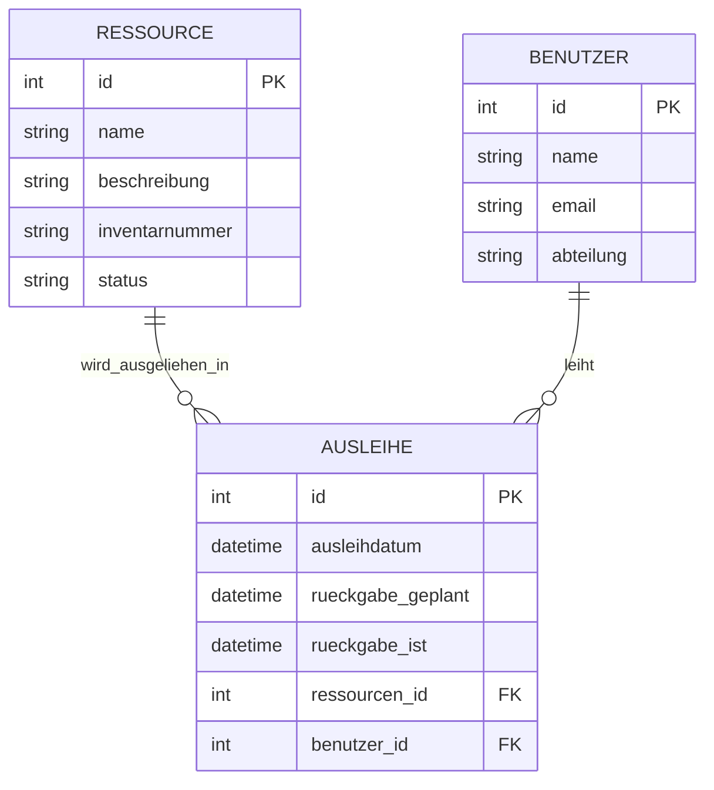

```mermaid
erDiagram
    RESSOURCE {
        int id PK
        string name
        string beschreibung
        string inventarnummer
        string status
    }

    BENUTZER {
        int id PK
        string name
        string email
        string abteilung
    }

    AUSLEIHE {
        int id PK
        datetime ausleihdatum
        datetime rueckgabe_geplant
        datetime rueckgabe_ist
        int ressourcen_id FK
        int benutzer_id  FK
    }

    RESSOURCE ||--o{ AUSLEIHE : wird_ausgeliehen_in
    BENUTZER ||--o{ AUSLEIHE : leiht
```