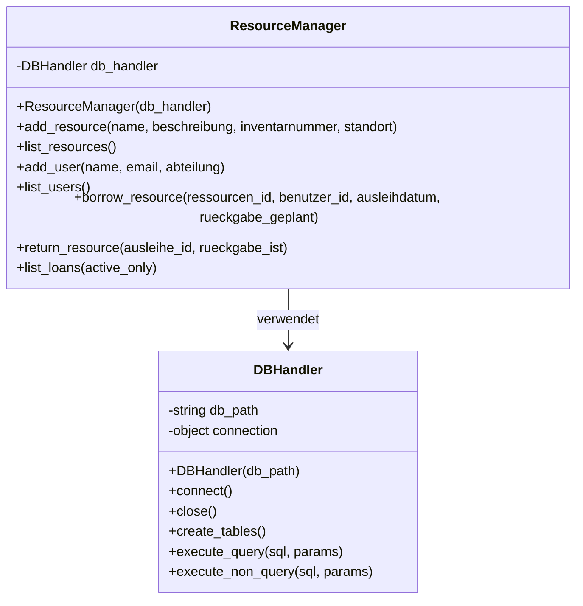

# Klassendiagramm: DBHandler und ResourceManager

```mermaid
classDiagram
    class DBHandler {
        -string db_path
        -object connection
        +DBHandler(db_path)
        +connect()
        +close()
        +create_tables()
        +execute_query(sql, params)
        +execute_non_query(sql, params)
    }

    class ResourceManager {
        -DBHandler db_handler
        +ResourceManager(db_handler)
        +add_resource(name, beschreibung, inventarnummer, standort)
        +list_resources()
        +add_user(name, email, abteilung)
        +list_users()
        +borrow_resource(ressourcen_id, benutzer_id, ausleihdatum, rueckgabe_geplant)
        +return_resource(ausleihe_id, rueckgabe_ist)
        +list_loans(active_only)
    }

    ResourceManager --> DBHandler : verwendet
```